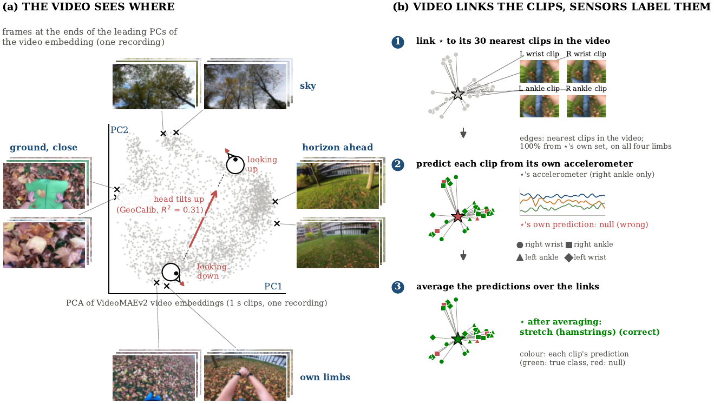

# What Egocentric Video Embeddings Encode and How to Combine Them with Inertial Sensors

Code for the paper *What Egocentric Video Embeddings Encode and How to Combine Them with Inertial
Sensors for Human Activity Recognition*.
Paper: [PDF (preprint)](paper/what-egocentric-embeddings-encode.pdf); an arXiv version will be posted soon (see [Citation](#citation)).



*(a) The leading principal components of a WEAR recording's video embedding follow where the camera looks.
(b) The video links a clip to its nearest clips, which come from the same set but carry other limbs; averaging their
inertial predictions corrects it. Frames from WEAR (Bock et al., 2024), CC BY-NC-SA 4.0, downscaled; this image is shared under CC BY-NC-SA 4.0.*

The repository reproduces every table and figure of the paper: the analysis of what pretrained
encoders capture from head-camera footage (Section 3), the method that propagates inertial predictions
over a within-participant video graph (Section 5) and all results (Section 7 and appendices).

## Setup

```bash
uv sync                      # Python >= 3.12
sudo apt install ffmpeg      # frame extraction for the analysis scripts
# optional, only for the analyses that need them
uv pip install "geocalib @ git+https://github.com/cvg/GeoCalib"   # camera tilt from frames (Section 3.3)
uv pip install ultralytics                                        # pose detector (Appendix D, item 13)
```

A CUDA GPU is used by the neural classifiers and some probes (`refine_gpu.py`); the final system itself
runs on a CPU in 0.6 s per participant in the median.

## Data

Nothing is redistributed here. Two locations are used:

| Location | Content | Source |
|---|---|---|
| `input/` | WEAR challenge data: `train/inertial_feat`, `train/videomae_feat`, `test` | the 3rd WEAR Dataset Challenge (Kaggle; CC BY-NC-SA 4.0) |
| `$WEAR_DATA` (default `data/`) | everything the analyses create or download (below) | |

`$WEAR_DATA` holds:

- `wear_raw_video/sbj_{0..21}.mp4`: public WEAR videos of the training participants only
  (`scripts_download_wear_video.sh`). Participants 22 and above are never used.
- `wear_frames/`, `wear_img_feats/{clip,dinov2,vc1}/`, `wear_seg/`, `wear_motion/`, `geocalib/`:
  created by `src/sec3_encode/wear_frames.py`, `src/sec3_encode/wear_encoders.py`, `src/sec3_encode/wear_segment.py`,
  `src/sec3_encode/wear_motion.py`, `src/sec3_encode/geocalib_frames.py`.
- `egoexo4d/`: Ego-Exo4D takes of six participants (basketball 356 and 383, dance 519 and 520,
  soccer 908 and 909), downloaded with the official `egoexo` CLI after accepting the Ego-Exo4D licence
  (https://ego4d.dev/request/ego-exo4d). Ego-Exo4D is used for the analysis only.
- `hf/`: Hugging Face cache (VideoMAEv2, CLIP, DINOv2, VC-1, SegFormer-B2).

## Reproducing the results

```bash
make classifiers   # preprocessing and all per-clip classifiers (out-of-fold predictions)
make table3        # Table 3 (main results) and the data for Figs. 5 and 7
make figures       # all figures
make submission    # the paper's configuration (public leaderboard 0.871)
make competition   # final challenge submission (public leaderboard 0.894; see below)
make extra         # four-sensor teacher and distillation (Section 7.3, Appendix C)
```

Each classifier is a file target (`experiments/<tag>/oof.npy`), so finished steps are skipped.
The other analyses are single scripts, e.g. `uv run python src/sec7_results/probe_review_ci_partial.py`
for the 95% intervals; see the table below.

`src/submit/submit_graph_band.py` adds the protocol count constraint of Section 8.2 after the last stage.
`make competition` (`src/submit/submit_band_inloop.py`) applies it between the propagation stages instead, with
λ = 2 and a share band for each pair of exercise variants (`src/sec8_protocol/probe_band_inloop.py` and
`src/sec8_protocol/probe_family_balance.py` give the cross-validation: 0.8688 → 0.8862, three seeds). This was our final
challenge submission; it is not part of the paper. No submission uses the adjacency of shuffled clips.

### Layout

Scripts are grouped by the part of the paper they serve; file names are those used during the
study, so that they match the development log.

| Folder | Content |
|---|---|
| `src/common/` | shared modules: configuration, metric, cross-validation, propagation, decision rule |
| `src/prepare/`, `src/train/` | preprocessing and the per-clip classifiers |
| `src/sec3_encode/` | Section 3: what the egocentric embeddings encode (Ego-Exo4D and WEAR) |
| `src/sec7_results/` | Section 7: main results, component removal, fusion, stages, robustness |
| `src/sec8_protocol/` | Section 8.2: adjacency of shuffled clips (measured only) and the count constraint |
| `src/submit/` | writing submission files |
| `src/appendix/` | the explanations and negative results of Appendices D and F |

Every script adds all `src/*/` folders to its import path, so it runs from any folder.

### Where each result comes from

| Paper | Script |
|---|---|
| Table 1 (datasets) | `prepare_windows.py`, `egoexo_viewpoint.py` |
| Section 3.2, Table 2, Fig. 3 | `egoexo_encoders.py`, `egoexo_exo.py`, `egoexo_exo_vc1.py`, `egoexo_viewpose.py`, `probe_layout_views.py`, `egoexo_tilt_view.py`, `repro_tilt_lopo.py` |
| Section 3.3 | `probe_layout_views.py`, `probe_body_scene.py`, `probe_tilt_transfer.py`, `probe_camtilt.py` |
| Section 3.4 | `probe_limbpred.py`, `probe_review_quasi.py` |
| Table 3, Fig. 5, Fig. 7, per-class table (App. B) | `probe_prf.py`, `repro_perclass.py` |
| 95% intervals, clips in parts | `probe_review_ci_partial.py` |
| Section 7.5 (decision rule and video rows), App. D item 9 | `repro_review_sensitivity.py` |
| Section 7.5 (label errors in the training data), Limitations | `repro_label_issues.py` |
| Fig. 6, m sweep, App. D items 4–6 | `probe_factor.py`, `repro_msweep.py` |
| Tables 4 and 5 (Section 7.2) | `wear_encoders.py`, `probe_wear_encoders.py`, `probe_pc_split.py`, `probe_body_scene.py`, `probe_camtilt.py`, `probe_motion.py`, `probe_semantic.py` (set `ENCS=VC-1` for the VC-1 column) |
| Section 7.3, Tables 6 and 7 | `probe_2x2.py`, `probe_cca.py`, `probe_lame.py`, `probe_wnn.py`, `repro_fusion.py`, `probe_adaptive.py`, `probe_inertial_edge.py`, `probe_placement_graph.py` |
| Section 7.4, Table 8, Fig. 8 | `probe_stage_ablation.py` |
| Section 7.5 | `probe_shared_graph.py`, `probe_seen_vs_unseen.py`, `probe_hard_subjects.py`, `probe_null_hier.py`, `probe_recal.py` |
| Section 8.2, App. G | `probe_chain.py`, `probe_succ_all.py`, `probe_chain_lap.py` (adjacency, measured only); `probe_countband*.py`, `probe_band_per_subject.py` |
| App. A | `repro_runtime.py`, `repro_match_public.py`, `probe_stage_blend.py`, `probe_gate.py` |
| App. C (base classifier) | `probe_base_ceiling.py`, `probe_residual.py`, `probe_cross_sensor.py` |
| App. D (explanations tested) | `probe_why_gain.py`, `probe_trapped.py`, `probe_mechanism*.py`, `probe_hub.py`, `probe_posture.py`, `probe_sync.py`, `probe_tensor.py`, `probe_decomp*.py` and the scripts named in the appendix |
| App. F (negative results) | the scripts named in the appendix |

### Notes

- The adjacency of shuffled test clips (Section 8.2) is analysed but used by no reported result and
  by no script that writes a submission here.
- Seeds: the random limb assignment of the validation data is repeated over seeds 42, 7 and 123.
  The neural classifiers are seeded but not bitwise deterministic on a GPU.

## Citation

The paper is on arXiv: *to be added*. Until then, please cite it as

```bibtex
@misc{habano2026egocentric,
  author = {Habano, Kansuke},
  title  = {What Egocentric Video Embeddings Encode and How to Combine Them with Inertial
            Sensors for Human Activity Recognition},
  year   = {2026},
  note   = {arXiv preprint, identifier to be added}
}
```

## Licence

The code is released under the MIT Licence (see `LICENSE`). It contains no data and no model
weights. The figures (`assets/teaser.png` and those in the paper PDF) contain frames from WEAR and are
shared under CC BY-NC-SA 4.0, not under the MIT Licence. The datasets and pretrained models it uses keep their own terms, which apply when you
download them: the WEAR dataset and challenge data (CC BY-NC-SA 4.0), Ego-Exo4D (its licence
agreement), VC-1 (CC BY-NC 4.0), and the licences of VideoMAEv2, CLIP, DINOv2, SegFormer and
GeoCalib. The optional pose detector (`ultralytics`) is AGPL-3.0.
